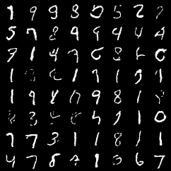

# Learning DDPM on MNIST

Parent repo overview: [../README.md](../README.md)

This repo is not trying to be a polished diffusion framework. It is mostly me working through the original DDPM idea on the smallest setup that still feels honest: MNIST, a compact U-Net, basic sanity checks, and a bunch of saved plots so I can see whether the model is actually learning anything.

The goal here was to understand the mechanics of denoising diffusion probabilistic models instead of hiding behind a huge codebase.

Original references:
- Paper: [Denoising Diffusion Probabilistic Models](https://arxiv.org/abs/2006.11239)
- Original code: [hojonathanho/diffusion](https://github.com/hojonathanho/diffusion)

## What is in here

- `src/` has the actual implementation: schedule, forward process, posterior math, DDPM sampling, training, and evaluation helpers.
- `notebooks/` are the guided task notebooks I used while learning the pipeline.
- `outputs/` stores the figures, checkpoints, and sample grids generated along the way.
- `docs/working_doc.md` is the more narrative experiment writeup.
- `docs/things_to_understand.md` is a list of concepts/questions that seem worth being able to explain clearly.
- `run_notes.md` is a compact log of what each saved artifact is trying to show.

## Setup

```bash
pip install -r requirements.txt
```

## Minimal runs

Task 0 data sanity check:

```bash
python -m src.data
```

Main training run:

```bash
python -m src.train
```

From the notebooks:

1. `notebooks/01_tasks_0_to_2_mnist_basics.ipynb`
2. `notebooks/02_tasks_3_to_5_train_and_sample.ipynb`
3. `notebooks/03_tasks_6_to_7_diagnostics_and_ablation.ipynb`

## What I was trying to learn

- Whether the forward process matches the theory numerically, not just symbolically.
- Whether the posterior step actually moves a noisy sample closer to the clean image.
- Whether a small time-conditioned U-Net can learn usable noise prediction on MNIST.
- What the denoising trajectory looks like when sampling from pure noise.
- How much schedule choice and timestep count matter once the ablations are given enough budget to be worth looking at.
- How to inspect memorization risk without pretending MNIST needs a giant benchmark stack.

## A few artifacts

Real MNIST batch after preprocessing:


Training snapshots as the model starts to learn structure:





Final sample grid and one denoising trajectory:


Schedule and evaluation artifacts:


## A few observations

- The early training snapshots are useful because they make it obvious when the model is still generating digit-like blobs instead of digits.
- The forward-process sanity checks line up well with theory in the notebook outputs, which made the later reverse-process debugging much easier.
- The saved nearest-neighbor grids are important here. On MNIST it is easy to generate plausible digits, but that is not the same as learning a good data distribution.
- Notebook 03 now treats the schedule ablation more seriously: stronger training budget plus an explicit linear-vs-cosine loss-curve comparison.
- The timestep ablation is no longer a single quick run. It now compares `1000`, `750`, `500`, and `250` steps across multiple fixed seeds and summarizes mean/std instead of overreading one trajectory.

## Repo shape

- `src/data.py`: MNIST loading and normalization to `[-1, 1]`
- `src/diffusion/schedule.py`: linear and cosine schedules
- `src/diffusion/forward.py`: forward diffusion utilities
- `src/diffusion/posterior.py`: reverse/posterior equations
- `src/diffusion/ddpm.py`: ancestral DDPM sampler
- `src/models/unet.py`: small time-conditioned U-Net
- `src/train.py`: `L_simple` training loop and sanity checks
- `src/eval.py`: diagnostics, sample grids, nearest neighbors, classifier-based metrics, FID/KID-style feature evaluation, ELBO/BPD estimate, schedule-loss tracking, and seed-aware task ablations

## Read next

- [Working doc](docs/working_doc.md)
- [Things to understand](docs/things_to_understand.md)
- [Run notes](run_notes.md)
