# Working Doc

This is the part of the repo that is meant to read like lab notes, not product documentation. The code is small on purpose, and the markdown here is mostly me trying to keep track of what each task was supposed to teach me.

## 1. Starting point

I wanted a DDPM implementation that was small enough to inspect end to end:

- one dataset: MNIST
- one image size: `28 x 28`
- one basic objective: noise prediction with `L_simple`
- one main model family: a compact time-conditioned U-Net

That keeps the questions manageable. If something breaks, it is more likely to be the math, indexing, normalization, schedule construction, or training loop, instead of some giant framework detail.

## 2. Data and preprocessing

The repo normalizes MNIST images into `[-1, 1]`. That sounds boring, but it matters because the diffusion formulas and reconstruction behavior depend on consistent scaling.

Notebook 01 confirms the basic assumptions:

- batch shape: `(128, 1, 28, 28)`
- dtype: `float32`
- min/max: `-1.0` and `1.0`

Reference grid:

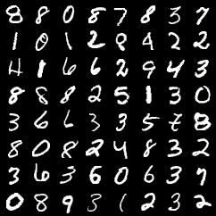

Things to understand:

- Why is `[-1, 1]` usually more convenient than `[0, 1]` in this kind of image model?
- What breaks if training data scaling and sample visualization scaling are inconsistent?
- Why is MNIST still useful even though it is far too simple for modern generative modeling claims?

## 3. Forward diffusion checks

Before trusting the reverse process, I wanted to verify the forward process numerically.

From notebook 01 at timestep `t = 300`:

- empirical global mean: `-0.4445`
- theoretical global mean: `-0.4454`
- empirical global variance: `0.6065`
- theoretical global variance: `0.6060`

That is close enough to make me believe the schedule extraction and noising code are wired correctly.

This stage matters because many later bugs look like "the model is bad" when the real issue is one of these:

- off-by-one timestep indexing
- using `alpha_t` where `alpha_bar_t` is needed
- noise sampled with the wrong shape or device
- mismatched data range assumptions

Things to understand:

- Why does `q(x_t | x_0)` have a closed form even though the forward process is defined recursively?
- What role does `alpha_bar_t` play compared with `alpha_t`?
- Why does the signal-to-noise ratio collapse as `t` increases?

## 4. Posterior sanity checks

The next step was checking that the posterior formulas are at least behaving sensibly:

- all posterior variances are positive
- for `t >= 1`, posterior variance stays below `beta_t`
- the posterior mean/variance tensors have the expected image-shaped broadcasting behavior

In notebook 02, a one-step posterior sanity check at timestep `200` gave:

- `mse(x_t, x_0) = 0.3772`
- `mse(x_{t-1}, x_0) = 0.3739`
- condition holds: `True`

That is a small but important signal: sampling one reverse step using the posterior should move things closer to the clean data on average.

Things to understand:

- Why is the posterior Gaussian even though the true reverse process of arbitrary data distributions is hard?
- Why is the model trained to predict noise, but sampling uses a mean/variance over `x_{t-1}`?
- What is the practical meaning of the posterior variance being smaller than `beta_t`?

## 5. Noise prediction model

The actual learned part is a time-conditioned epsilon model. In this repo that is a small U-Net with timestep embeddings.

The first question here was not "is this state of the art?" It was simpler:

Can a compact network, trained on MNIST with uniform timestep sampling, learn to predict the added noise well enough that ancestral denoising starts producing recognizable digits?

Notebook 02 gave a strong yes:

- noise correlation at timestep `200`: `0.9809`
- noise MSE at timestep `200`: `0.0377`
- timestep sampling max absolute frequency error: `0.000225`

That last check is easy to overlook. If timestep sampling is biased, training quietly optimizes the wrong weighting over the diffusion chain.

## 6. Training progression

The training snapshots are some of the most useful artifacts in the repo because they show when the model crosses from "recognizable blur" to "actual digits."

Early:

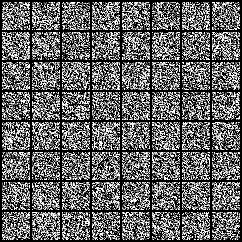

Getting somewhere:

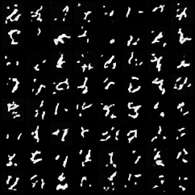
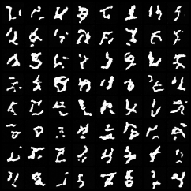

Much cleaner:

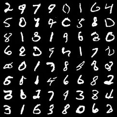

Final sampled grid:

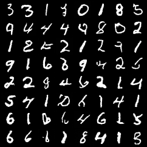

What I like about these plots is that they show learning as a process instead of only showing the final nicest grid.

Things to understand:

- Why does diffusion training often look visually bad for a long time and then improve suddenly?
- What does a low per-pixel noise MSE fail to tell us about sample quality?
- Why can sample sharpness, diversity, and likelihood-ish metrics disagree?

## 7. Reverse trajectory

I saved a denoising trajectory with a fixed seed so the reverse chain is not just a theoretical idea in the notebook.

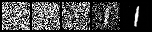

Later diagnostics also save:

This was one of the most helpful visual checks for me. If the reverse chain is unstable, overconfident, or just wrong, it often shows up here before it shows up in aggregate metrics.

Things to understand:

- Why does ancestral sampling stay stochastic even after training?
- What information is lost by the end of the forward chain, and how is the model recovering structure from noise?
- Why do errors made at late timesteps sometimes damage the whole sample disproportionately?

## 8. Evaluation mindset

This repo uses a small evaluation stack that feels appropriate for a learning project:

- sample grids
- denoising trajectories
- nearest-neighbor visual checks
- classifier-feature FID/KID-style comparisons
- simple confidence/diversity summaries
- rough ELBO/BPD estimate

Task 7 notebook output on a small run reported:

- classifier test accuracy: `0.9736`
- feature FID against test set: `40.39`
- feature KID against test set: `10.60`
- generated mean confidence: `0.8838`
- generated class entropy normalized: `0.9958`
- generated nearest-neighbor label accuracy proxy: `0.8281`
- BPD estimate mean: `19.27`

Nearest-neighbor check:

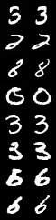

Loss curve:

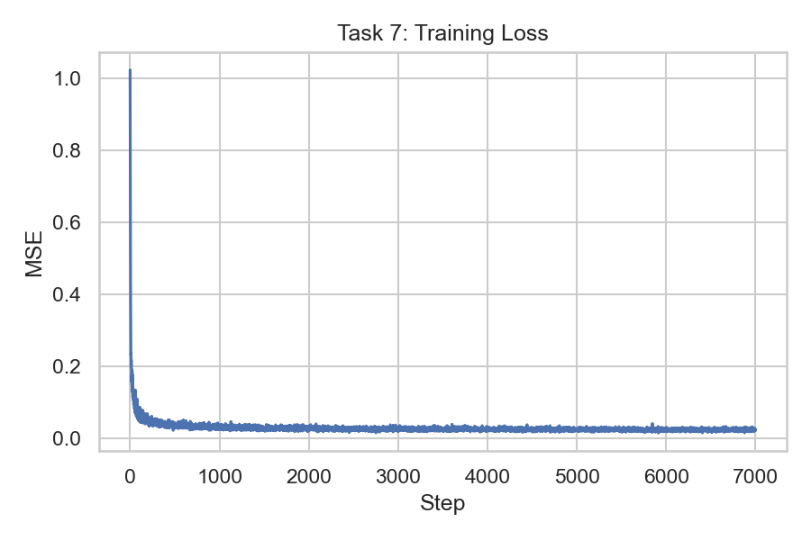

I do not read those numbers as a leaderboard result. I read them as consistency checks:

- Are the samples classifiable as digits?
- Are all classes roughly showing up?
- Are generated digits suspiciously close to training images?
- Are train-vs-test feature distances behaving oddly?

Things to understand:

- Why is FID on MNIST with a small custom classifier more of a diagnostic than a benchmark?
- Why can nearest-neighbor checks catch memorization stories that a single scalar score misses?
- Why is "classifier confidence" not the same as "good generation"?

## 9. Schedule ablation

One experiment in notebook 03 compares linear and cosine schedules with a limited training budget.

Saved outputs:

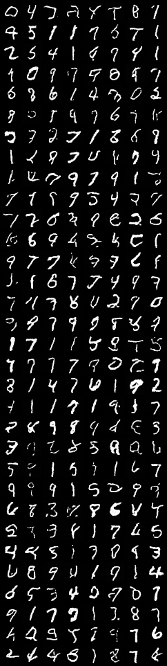
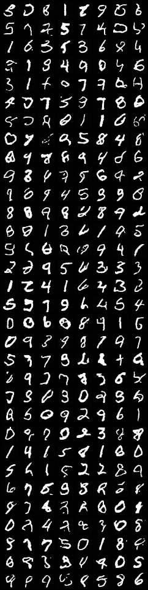

Nearest-neighbor figures:

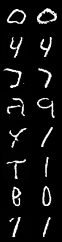
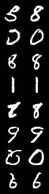

Small-run summary from the notebook:

| schedule | final loss | feature FID test | feature KID test | class entropy norm | mean confidence | BPD |
| --- | ---: | ---: | ---: | ---: | ---: | ---: |
| linear | 0.03457 | 424.85 | 177.70 | 0.9175 | 0.6616 | 38.98 |
| cosine | 0.05231 | 321.54 | 156.35 | 0.9403 | 0.7240 | 30.91 |

Interesting part: the lower training loss did not correspond to better downstream sample metrics here. On this budget, cosine looked better overall.

Things to understand:

- Why can a schedule with worse final training loss still produce better samples?
- How does the schedule change the difficulty distribution across timesteps?
- Why did cosine scheduling become such a common baseline after the original DDPM paper?

## 10. Timestep-count ablation

I also compared different diffusion lengths.

Saved outputs:

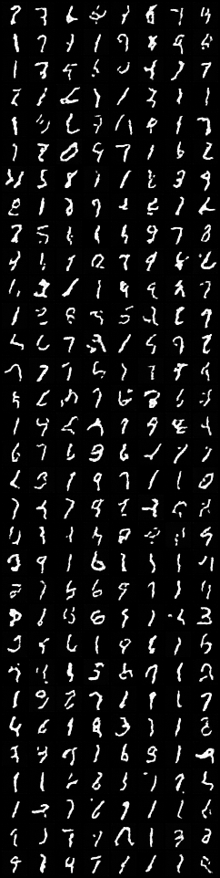
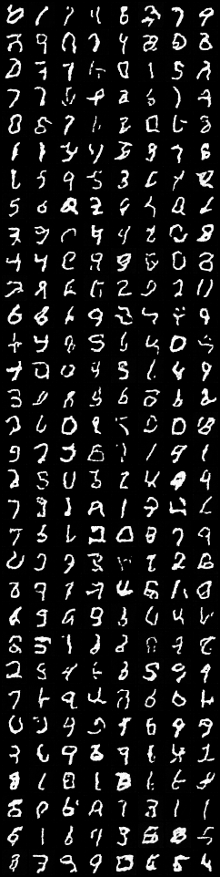
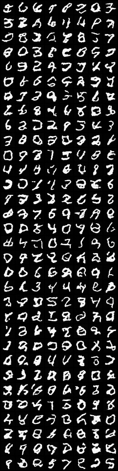

And the associated nearest-neighbor grids:

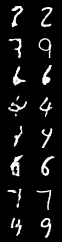
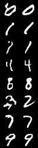
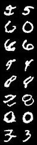

Notebook 03 summary:

| timesteps | final loss | feature FID test | feature KID test | class entropy norm | mean confidence | BPD |
| --- | ---: | ---: | ---: | ---: | ---: | ---: |
| 1000 | 0.05120 | 579.40 | 215.86 | 0.8716 | 0.6223 | 72.37 |
| 500 | 0.07743 | 569.95 | 211.03 | 0.9104 | 0.6223 | 83.63 |
| 250 | 0.10800 | 658.63 | 226.56 | 0.9225 | 0.5435 | 79.84 |

The main lesson for me was not "1000 is best" or "500 is best." It was that timestep count interacts with training budget, schedule shape, and model capacity. Reducing the chain changes both optimization and sampling behavior.

Things to understand:

- What changes when you shorten the diffusion chain but keep the rest of the setup fixed?
- Why is fewer timesteps not automatically better even though sampling becomes cheaper?
- How do timestep count and schedule type interact?

## 11. Toy 2D metrics

There is also a tiny toy-data section with sliced Wasserstein distance and RBF-MMD utilities, mainly to make the metric ideas more concrete in low dimension.

- toy SWD: `0.0150`
- toy RBF-MMD: `0.00121`

Plot:

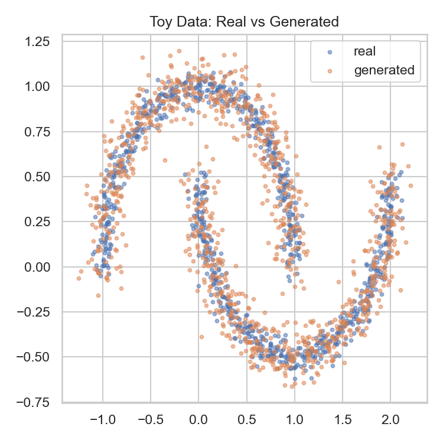

This is not central to the MNIST DDPM, but it helped me reason about distribution matching visually before trusting scalar metrics.

## 12. What I would improve next

- add cleaner experiment logging so the markdown does not rely on notebook output cells for numbers
- normalize notebook metadata and IDs
- run stronger ablations with matched compute budgets
- compare epsilon prediction with `x_0` or `v` prediction
- inspect per-timestep loss instead of only aggregate loss

## 13. Takeaway

The main value of this repo is not that it trains a tiny MNIST diffusion model. The value is that every moving part is visible:

- data scaling
- schedule creation
- forward noising
- posterior equations
- timestep conditioning
- training objective
- ancestral denoising
- diagnostic plots
- simple anti-memorization checks

That made DDPM feel less like magic and more like a chain of testable assumptions.
